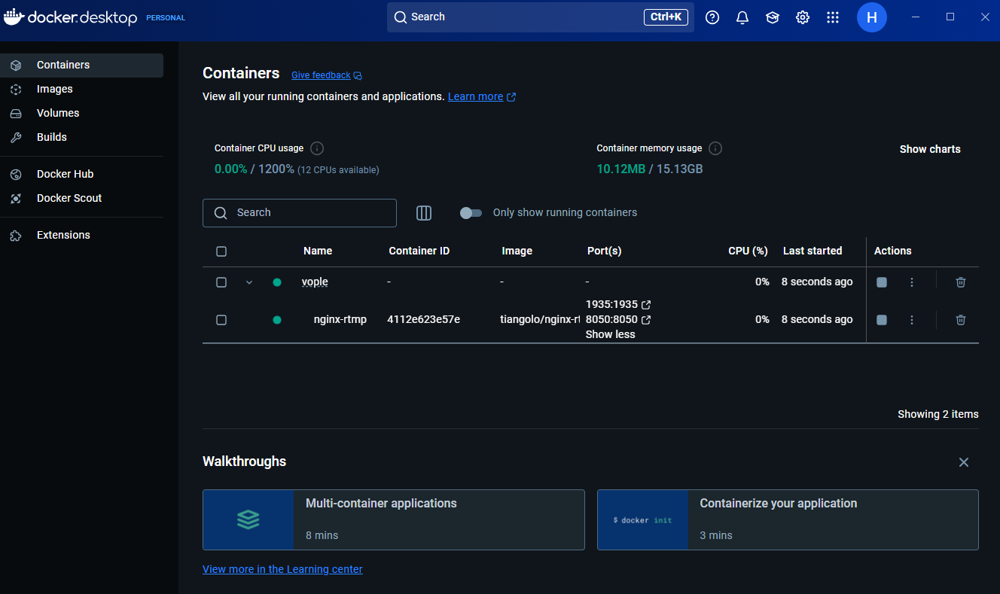

# ✨ VOPLE

### RTMP 실행 방법
1. Docker Desktop 설치
2. 터미널에서 `compose.yml`이 위치한 폴더로 가서 `docker compose up` 실행
3. 그럼 rtmp/hls가 돌아갑니다.


실행 시 이런 상태

### 개발 환경
- 기본적으로 올려둔 compose.yml은 현재 nginx-rtmp 컨테이너만 활성화했으므로 그냥 실행해도 됨
- 단, MySQL과 Spring Boot, client project는 docker를 통하지 않고 직접 실행하는 방식

### Spring Boot application 실행 전
- **Mysql database vople은 직접 생성해줘야 합니다(`/db/init.sql` 실행). -> 추후 로컬은 h2 전환예정** 

## 폴더 구조
### 전체
```
├── 📁 client
│   ├── 📁 Client project (업로드 예정)
│   ├── HLSClientExample.html (HLS 스트리밍 client 예시파일, 설명 있음)
│   ├── Dockerfile (docker compose 실행 시 함께 실행됨)
├── 📁 db
│   ├── init.sql (DDL 정의 - schema, table)
├── 📁 hls (폴더 이하 내용은 방송 시작 시 생성, 종료 시 삭제됨)
│   ├── 스트리밍key-스트림번호.ts
│   ├── 스트리밍key.m3u8
├── 📁 nginx
│   ├── default.conf
│   ├── rtmp.conf
├── 📁 redis
│   ├── (Docker volume mount를 위한 빈 폴더, 관련 설정 생길 시 추가)
├── 📁 server
│   ├── 📁 Spring Boot server project
├── compose.yml
├── README.md

```
### Server - Spring Boot package
```
├── 📁 com.votegaheneta
│   ├── 📁 test (추후 본 개발 시 삭제)
│   │   ├── TestController.java
│   │   ├── StreamTestController.java
│   ├── 📁 Configuration
│   │   ├── WebConfig.java
│   │   ├── SecurityConfig.java
│   ├── 📁 server
│   │   ├── ServerApplication.java
```

### Client (필요 시 작성)
```
├── 📁 votegaheneta
│   ├── 📁 test
│   │   ├── 📁
```